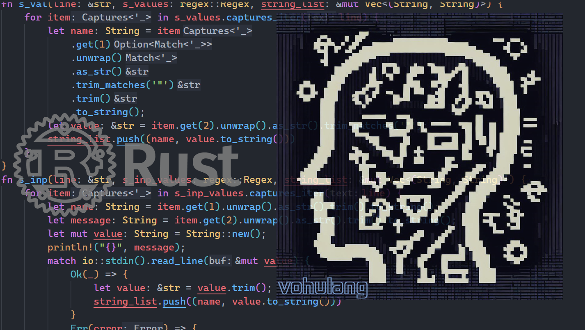
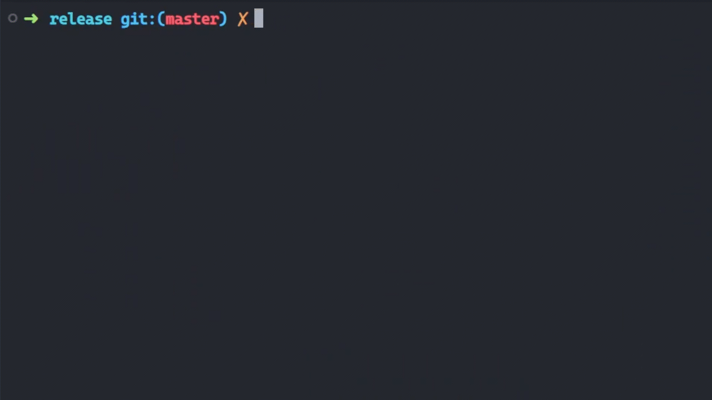

<p align="center">
  <a href="https://github.com/houshmand-2005/vohulang" target="_blank" rel="noopener noreferrer">
      
  </a>
</p>
<h1 align="center"/>Vohulang</h1>

<p align="center">A programming language based on <a href="https://github.com/rust-lang/rust">Rust</a> language
</p>

<p align="center">
  <a href="httpps://github.com/houshmand-2005/vohulang" target="_blank">
    
  </a>
</p>

## Table of Contents

- [Overview](#overview)
  - [Why using Vohulang?](#why-using-vohulang)
    - [Features](#features)
- [How to run?](#how-to-run)
- [Samples](#samples)
- [Commands](#commands)
- [Compile guide](#compile-guide)

# Overview

This is a programming language based on the Rust language, in fact, it reads the program commands line by line and executes them on the Rust

## Why using Vohulang?

Vohulang is not a complete programming language, I made this project to learn the Rust language

### Features

- Support **String** type
- Support **Integer** type
- Support **For loops**
- Support **Mathematical operations** such as addition, subtraction, multiplication and division
- Support **Print values**
- Support **Input data from users**
- Support **And more soon**
  <br>

# How to run?

First, download the executable file of the program

```bash
➜ ./vohulang
Please provide the program file as a command-line argument
Like 'cargo run your_program.vo' or
For compiled veriosn 'vohulang your_program.vo'
```

run this sample test [square_area.vo](samples/square_area.vo):

```bash
➜ ./vohulang samples/square_area.vo
-----Square Area-----
Enter the length of one side :
20
The area is equal to :
400
------- done --------
```

# Samples

sample programs:<br>

- Program to get square area [square_area](samples/square_area.vo)<br>
- Test program for all language operations [all_commands](samples/all_commands.vo)

# Commands

`[START]`

```bash
[START]
```

**This means that you start the program**<br>

`[S! ...] > ("...")`

```bash
[S! name] > ("Houshmand")
```

**You can Integer string values like this** <br>
N! means the content is Integer

`[N! ...] > ("...")`

```bash
[N! number1] > (5)
```

**You can insert in values like this** <br>
S! means the content is string

`[PS! ...]`

```bash
[PS! number1]

output:
5
```

**You can show the variable with PS!**<br>
PS! means print data into string

`[INP! ...] > (S! ...)`

```bash
[INP! name1] > (S! enter you name : )
output:
enter you name :

```

**You can get the string values from user with INP!**<br>
data will be stored in name1 variable [INP! **name1**]

`[FOR! ...] > (PS! ...)`

```bash
[S! split] > ("Hi im just a simple loop")
[FOR! 2] > (PS! split)
output:
'Hi im just a simple loop'
'Hi im just a simple loop'
```

**You can make loops with FOR!**<br>
This loop will continue to the number you announce here [FOR! **2**]<br>
And the operation you declare here will be done (**PS!** split)

`[+! ...] > (... + ...)`

`[-! ...] > (... - ...)`

`[*! ...] > (... * ...)`

`[/! ...] > (... / ...)`

```bash
[+! result] > (number1 + 150 + 1)
[PS! result]
output:
156

[-! result1] > (12 - 1)
[PS! result]
output:
11

[*! mul] > (3 * number1)
[PS! mul]
output:
15

[/! newnumber] > (20 / 2)
[PS! newnumber]
output:
10
```

**Mathematical operations of addition, subtraction, multiplication, division**<br>
Specify the operation : [**+!** result]<br>
Specify the name of the output variable of the operation : [+! **result**]<br>
Specify variables or numbers to perform the operation : [+! result] > (**number1 + 2 + 10**)
<br>

`[END]`

```bash
[END]
```

**This means that you end the program**<br>

<br>

# Compile guide

At first you need install Rust and Cargo
you can do it by this tutorial <a href="https://www.rust-lang.org/tools/install">Install Rust</a>
then you can build and complie this project (in release mode ) :

```bash
cargo build --release
```

<hr>
<div align="center">

</div>
